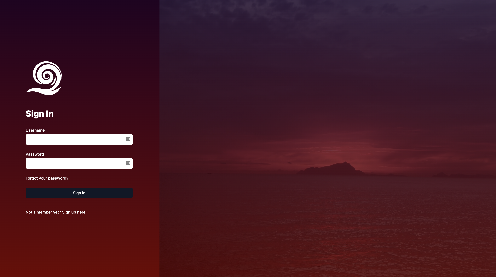

# 12-08-2021 - Sign Up and Sign In with Moralis

Making my sign up with moralis was super simple. I chose to go the email sign up route and then connect the wallet later. This is to give users a chance to enjoy making content without worrying about connecting MetaMask right off the start.

## Color Scheme

Since my color scheme worked well for the dashboard layout I decided to use it again for the auth layout. As stated previously in my ReadME, this project will have several different regions that require different layouts. That is why I created a dedicated Auth layout to give that great first impression for users signing up.

## Video

I decided on the desktop version to use a free video from pexels to give the sign up screen a bit more life. Here is that resource if you ever need it. At 50MB the video is too big to use for production so going to find a compressor to try to get it as small as possible.

[Pexels Wave Video](https://www.pexels.com/video/body-of-water-with-view-of-silhouette-of-a-mountain-at-sunset-2257012/)

## Up Next

I still need to make a password recovery page and link that to SendGrid which is the service I am using to send transactional emails.

